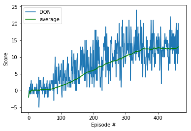

[//]: # (Image References)

[image1]: https://github.com/EmmeTrader/DeepRL-P1-Navigation/blob/main/images/banana.gif "banana"

# Project 1: Navigation

### Introduction

For this project, you will train an agent to navigate (and collect bananas!) in a large, square world.  

Below is the evolution of the reward function along the episodes.

A reward of +1 is provided for collecting a yellow banana, and a reward of -1 is provided for collecting a blue banana.  Thus, the goal of your agent is to collect as many yellow bananas as possible while avoiding blue bananas.  

The state space has 37 dimensions and contains the agent's velocity, along with ray-based perception of objects around agent's forward direction.  Given this information, the agent has to learn how to best select actions.  Four discrete actions are available, corresponding to:
- **`0`** - move forward.
- **`1`** - move backward.
- **`2`** - turn left.
- **`3`** - turn right.

The task is episodic, and in order to solve the environment, your agent must get an average score of +13 over 100 consecutive episodes.

### About Deep Reinforcement Learning

> [Reinforcement learning](https://skymind.ai/wiki/deep-reinforcement-learning) refers to goal-oriented algorithms, which learn how to attain a complex objective (goal) or maximize along a particular dimension over many steps; for example, maximize the points won in a game over many moves. They can start from a blank slate, and under the right conditions they achieve superhuman performance. Like a child incentivized by spankings and candy, these algorithms are penalized when they make the wrong decisions and rewarded when they make the right ones – this is reinforcement.

This project implement a Value Based method called [Deep Q-Networks](https://deepmind.com/research/dqn/)

### Environment details

The environment is based on [Unity ML-agents](https://github.com/Unity-Technologies/ml-agents)

Note: The project environment provided by Udacity is similar to, but not identical to the [Banana Collector](https://github.com/Unity-Technologies/ml-agents/blob/master/docs/Learning-Environment-Examples.md#banana-collector) environment on the Unity ML-Agents GitHub page.

> The Unity Machine Learning Agents Toolkit (ML-Agents) is an open-source Unity plugin that enables games and simulations to serve as environments for training intelligent agents. Agents can be trained using reinforcement learning, imitation learning, neuroevolution, or other machine learning methods through a simple-to-use Python API. 

A reward of +1 is provided for collecting a yellow banana, and a reward of -1 is provided for collecting a blue banana. Thus, the goal of your agent is to collect as many yellow bananas as possible while avoiding blue bananas.

The state space has 37 dimensions and contains the agent's velocity, along with ray-based perception of objects around the agent's forward direction. 

Given this information, the agent has to learn how to best select actions. Four discrete actions are available, corresponding to:

- 0 - move forward.
- 1 - move backward.
- 2 - turn left.
- 3 - turn right.

The task is episodic, and **in order to solve the environment, the agent must get an average score of +13 over 100 consecutive episodes.**

### Repository structure
The code files are structured as follows: 
* **Navigation.ipynb**: this is where the deep rl agent is trained.
* **dqn_agent.py**: this module implements a class to represent a vanilla dqn agent.
* **model.py**: this module contains the implementation of the neural network approximating the action value function.
* **checkpoint.pth**: this is the binary containing the trained neural network weights.

### Dependencies
* python 3.6
* numpy: install with 'pip install numpy'.
* PyTorch: install by following the instructions [here](https://github.com/reinforcement-learning-kr/pg_travel/wiki/Installing-Unity-ml-agents-on-Windows).
* ml-agents: install by following instructions [here](https://github.com/Unity-Technologies/ml-agents/blob/master/docs/Installation-Windows.md).

## Getting Started
In cell 2 of Navigation.ipynb we import the Unity environment from a remote server. For a local installation of the Unity ml-agents, please refer to the following two sources:
* [Linux, Mac](https://github.com/Unity-Technologies/ml-agents/blob/master/docs/Installation.md)
* [Windows 10](https://github.com/Unity-Technologies/ml-agents/blob/master/docs/Installation-Windows.md)

## Instructions
This is a jupyter notebook project. To run the code and train the deep reinforcement learning agent, you simply execute each of the cells in **Navigation.ipynb**. After training, the average score per hundred episodes will be displayed.
