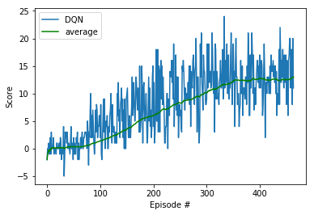

#### Udacity Deep Reinforcement Learning Nanodegree
### Project 1: Navigation
# Training a RL Agent to collect yellow bananas, while avoiding blue ones

## Table of Contents  

[Environment details](#Environment details)

[Algorithm](#First)

[Hyperparameters](#Hyperparameters)

[Results](#Results)

[Future Work](#Future_Work)  

## Environment details

The environment is based on [Unity ML-agents](https://github.com/Unity-Technologies/ml-agents)

Note: The project environment provided by Udacity is similar to, but not identical to the Banana Collector environment on the Unity ML-Agents GitHub page.

> The Unity Machine Learning Agents Toolkit (ML-Agents) is an open-source Unity plugin that enables games and simulations to serve as environments for training intelligent agents. Agents can be trained using reinforcement learning, imitation learning, neuroevolution, or other machine learning methods through a simple-to-use Python API. 

A reward of +1 is provided for collecting a yellow banana, and a reward of -1 is provided for collecting a blue banana. Thus, the goal of the agent is to collect as many yellow bananas as possible while avoiding blue bananas.

The state space has 37 dimensions and contains the agent's velocity, along with ray-based perception of objects around the agent's forward direction. 

Given this information, the agent has to learn how to best select actions. Four discrete actions are available, corresponding to:

- 0 - move forward.
- 1 - move backward.
- 2 - turn left.
- 3 - turn right.

The task is episodic, and **in order to solve the environment, the agent must get an average score of +13 over 100 consecutive episodes.**

<a name="First"></a>
## Algorithm

The deployed solution implements a *Value Based* method called [Deep Q-Networks](https://deepmind.com/research/dqn/). 

**Q-Learning** is an algorithm that allows RL agents to learn a policy to decide which actions to take within an environment. The goal is to find an optimal policy, which means a policy that maximizes the rewards collected by the agent. The value of each possible actions in terms of rewards is not known in advance and an optimal policy must be learned through a process of trial and error by interacting with the environment and recording observations, a process that iteratively maps different environment states to the actions that yield the highest reward.

**Deep Q Learning** is a combination of two approaches :
- A Reinforcement Learning method called [Q Learning](https://en.wikipedia.org/wiki/Q-learning) 
- A Deep Neural Network to learn and approximate an optimal Q-table (action-values map)

Inspired by the work of [Deepmind](https://deepmind.com), as described in their [Nature publication : "Human-level control through deep reinforcement learning (2015)"](https://storage.googleapis.com/deepmind-media/dqn/DQNNaturePaper.pdf), two improvements have been implemented:
- Experience Replay 
- Fixed Q Targets

Experience replay improves learning through repetition and past experience. By doing multiple passes over the data, the RL agent has multiple opportunities to learn from a single experience tuple. Each experience is stored in a replay buffer as the agent interacts with the environment. The replay buffer contains a collection of experience tuples with the state, action, reward, and next state `(s, a, r, s')`. Sampling from this buffer is part of the agent's learning step. Experiences are sampled randomly, so that the data correlation is potentially reduced and avoided. This allows action values to not oscillate or diverge dramatically, otherwise a basic Q-learning agent could become biased by correlations between sequential experience tuples.

The Fixed Q Targets solution was introduced by the DeepMind team. Using two DQNs instead of one, this method keeps the target values of one network (called the target network) fixed and periodically updates the network weights. 

**Code implementation**

The code implementation is derived from the "Lunar Lander" example from the [Deep Reinforcement Learning Nanodegree](https://www.udacity.com/course/deep-reinforcement-learning-nanodegree--nd893), and has been slightly adjusted for being used with the Unity banana environment instead of the original OpenAI environment.

The **model.py** file contains the definition of a QNetwork class, a fully connected deep neural network based in the [PyTorch Framework](https://pytorch.org/docs/0.4.0/).
The goal of this deep NN is to predict the best action to perform based on the environment observerd states. 
Here is the network architecture:
```
QNetwork(
  (fc1): Linear(in_features=37, out_features=128, bias=True)
  (fc2): Linear(in_features=128, out_features=64, bias=True)
  (out): Linear(in_features=64, out_features=4, bias=True)
)
```
The inputs are the 37 state variables from the Unity environment and the final output is 4 like the action space size.

The **dqn_agent.py** file contains the DQN class Agent and the class ReplayBuffer.

The DQN class Agent contains 5 methods:
- constructor, which initializes the memory buffer and two instances of the deep NN (target and local)
- step(), which allows to store a step taken by the RL agent (state, action, reward, next_state, done) in the Replay Buffer/Memory. Every four steps, it updates the target NN weights  with the current weight values from the local NN (Fixed Q Targets technique)
- act(), which returns actions for given state as per current policy through an Epsilon-greedy selection in order to balance exploration and exploitation in the Q Learning process
- learn(), which updates value parameters using given batch of experience tuples in the form of (state, action, reward, next_state, done) 
- soft_update(), which is used by the learn() method to softly updates the target NN weights from the local NN weights

The ReplayBuffer class consists of Fixed-size buffer to store experience tuples (state, action, reward, next_state, done)  and contains these methods:
- add(), which adds a new experience tuple to memory
- sample(), which randomly sample a batch of experiences from memory for the learning process of the agent
- len(), which returns the current size of internal memory

      
The Navigation.ipynb is the Jupyter notebook where I trained the agent. These are the steps taken in it:
  - Importing the necessary packages 
  - Examining the State and Action Spaces
  - Testing random actions in the Environment
  - Training a DQN agent
  - Ploting the training scores 

<a name="Hyperparameters"></a>
## Hyperparameters:
* BUFFER_SIZE = int(1e5)  # replay buffer size
* BATCH_SIZE = 64         # minibatch size
* GAMMA = 0.99            # discount factor
* LR = 5e-4               # learning rate
* TAU = 1e-3              # for soft update of target parameters
* UPDATE_EVERY = 4        # how often to update the network

<a name="Results"></a>
## Results

Here is the evolution of the score per episodes:



<a name="Future_Work"></a>
## Future Work

Here are some ideas on further developments of the algorithm, beyond simply playing around with the presented architecture and hyperparameters tuning.

An alternative way to train the agent can be about learning directly from the environment's observed pixels. This can be done by modifying the neural network architecture by using [Convolutional Neural Networks](https://en.wikipedia.org/wiki/Convolutional_neural_network) layers to process the raw pixels corresponding to the agent's first-person view of the environment.

There are also other several different methods that can improve the DQN agent's learning and performance:

- [Deep Reinforcement Learning with Double Q-learning](https://arxiv.org/abs/1509.06461)
> The popular Q-learning algorithm is known to overestimate action values under certain conditions. It was not previously known whether, in practice, such overestimations are common, whether they harm performance, and whether they can generally be prevented. In this paper, we answer all these questions affirmatively. In particular, we first show that the recent DQN algorithm, which combines Q-learning with a deep neural network, suffers from substantial overestimations in some games in the Atari 2600 domain. We then show that the idea behind the Double Q-learning algorithm, which was introduced in a tabular setting, can be generalized to work with large-scale function approximation. We propose a specific adaptation to the DQN algorithm and show that the resulting algorithm not only reduces the observed overestimations, as hypothesized, but that this also leads to much better performance on several games.

- [Dueling Network Architectures for Deep Reinforcement Learning](https://arxiv.org/abs/1511.06581)
> In recent years there have been many successes of using deep representations in reinforcement learning. Still, many of these applications use conventional architectures, such as convolutional networks, LSTMs, or auto-encoders. In this paper, we present a new neural network architecture for model-free reinforcement learning. Our dueling network represents two separate estimators: one for the state value function and one for the state-dependent action advantage function. The main benefit of this factoring is to generalize learning across actions without imposing any change to the underlying reinforcement learning algorithm. Our results show that this architecture leads to better policy evaluation in the presence of many similar-valued actions. Moreover, the dueling architecture enables our RL agent to outperform the state-of-the-art on the Atari 2600 domain.

- [Prioritized experience replay](https://arxiv.org/abs/1511.05952)
> Experience replay lets online reinforcement learning agents remember and reuse experiences from the past. In prior work, experience transitions were uniformly sampled from a replay memory. However, this approach simply replays transitions at the same frequency that they were originally experienced, regardless of their significance. In this paper we develop a framework for prioritizing experience, so as to replay important transitions more frequently, and therefore learn more efficiently. We use prioritized experience replay in Deep Q-Networks (DQN), a reinforcement learning algorithm that achieved human-level performance across many Atari games. DQN with prioritized experience replay achieves a new state-of-the-art, outperforming DQN with uniform replay on 41 out of 49 games.

- [A Distributional Perspective on Reinforcement Learning](https://arxiv.org/abs/1707.06887)
> In this paper we argue for the fundamental importance of the value distribution: the distribution of the random return received by a reinforcement learning agent. This is in contrast to the common approach to reinforcement learning which models the expectation of this return, or value. Although there is an established body of literature studying the value distribution, thus far it has always been used for a specific purpose such as implementing risk-aware behaviour. We begin with theoretical results in both the policy evaluation and control settings, exposing a significant distributional instability in the latter. We then use the distributional perspective to design a new algorithm which applies Bellman's equation to the learning of approximate value distributions. We evaluate our algorithm using the suite of games from the Arcade Learning Environment. We obtain both state-of-the-art results and anecdotal evidence demonstrating the importance of the value distribution in approximate reinforcement learning. Finally, we combine theoretical and empirical evidence to highlight the ways in which the value distribution impacts learning in the approximate setting.

- [Rainbow: Combining Improvements in Deep Reinforcement Learning](https://arxiv.org/abs/1710.02298)
> The deep reinforcement learning community has made several independent improvements to the DQN algorithm. However, it is unclear which of these extensions are complementary and can be fruitfully combined. This paper examines six extensions to the DQN algorithm and empirically studies their combination. Our experiments show that the combination provides state-of-the-art performance on the Atari 2600 benchmark, both in terms of data efficiency and final performance. We also provide results from a detailed ablation study that shows the contribution of each component to overall performance.
